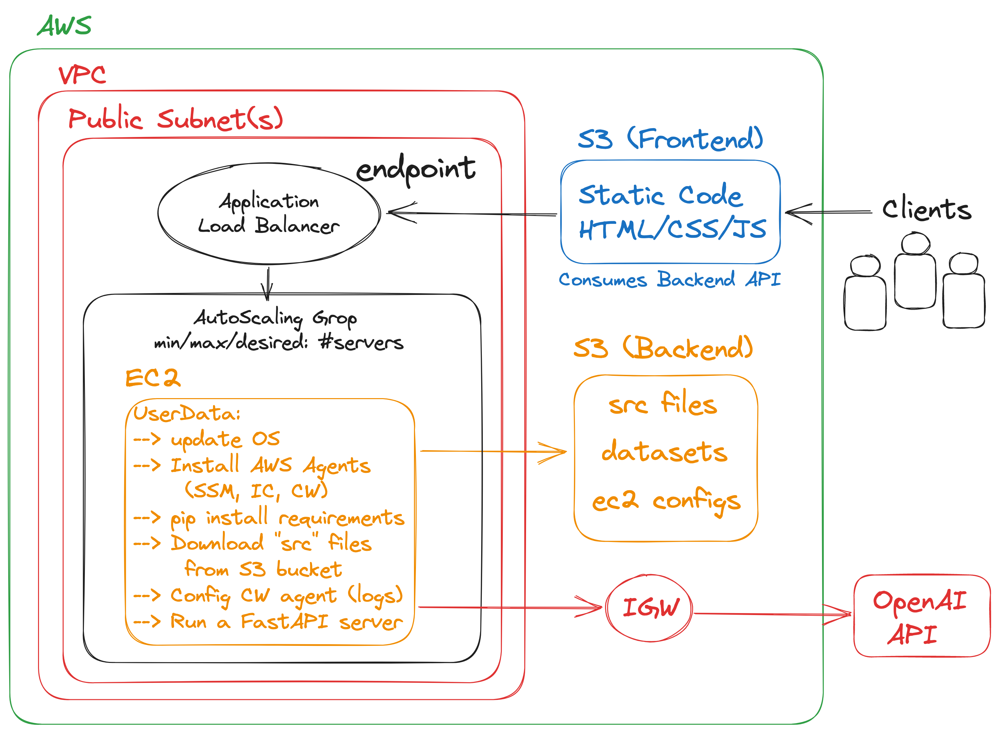

# AWS OPENAI CHATBOT

> IMPORTANT: This project is ONLY a PoC, so do NOT use it for production-grade deployments.

This is a PoC project developed for a client/friend, that needed a simple OpenAI/Data-Processing Chatbot with the following requirements:

- Compute processing for a Data-Science project that used libraries such as Pandas, ScikitLearn, Matplotlib, Plotly, etc.
- Connectivity to OpenAI API, to process requests and using OpenAI Python library.
- Expose Backend functionality with an API that could be consumed by a Frontend.
- Fronted deployed with simple static code that consumes the Backend API.
- All infrastructure on AWS.
- Logs on CloudWatch and scalability in case of increase of requests/clients.

## Architecture

The AWS infrastructure for the solution is the following (with decoupled fronted/backend):

  

## Manual Steps for Deployment of Stacks

1. Create Systems Manager Parameter in Parameter Store for the OpenAI Key:

   - Log in to your target AWS account.
   - Go to "Systems Manager", and click on "Parameter Store".
   - Create a parameter called `/openai-bot-backend/dev/openai-key`, add the OpenAI Key inside. (Note: if multi-environment deployment is needed, update as needed).

2. Deploy CDK Backend Stack:

   - Deploy Backend with: `bash deploy-backend.sh`

3. Update Frontend with the Backend API Endpoint:

   - The "Outputs" of the CDK Backend Stack will contain the Backend API DNS.
   - Update the `./website/config.js` with the corresponding endpoint variable.

4. Deploy CDK Frontend Stack:
   - Deploy Frontend with: `bash deploy-frontend.sh`

## Important: Deprecation of Lambda-based Architecture

The `DEPRECATED` folders was an attempt to deploy the solution on top of AWS Lambda Functions, but the limitation of the "max" size of Lambda Layers (individual or aggregated), was an stopper to achieve this approach. That's why there are multiple lambda-layer folders with the different attempts to achieve ALL the necessary Python Dependencies for the client (OpenAI, Pandas, matplotlib, plotly, sklearn, tenacity, urllib3, etc...). That's why the final architecture was a simple FastAPI server running on EC2 instances in an ASG, exposed on an ALB that the Frontend consumes.

## LICENSE

Copyright 2023 Santiago Garcia Arango
